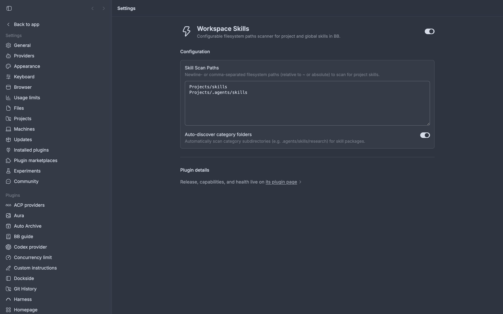

# bb-plugin-workspace-skills

Configurable filesystem scanner for project and external skills in BB.

Allows users to configure arbitrary filesystem paths (e.g. `Projects/skills`, `Projects/.agents/skills`) in BB Settings or via CLI, automatically discovers skill packages, registers them into BB's shared skill roots (`~/.bb/config.json`), and reloads BB on the fly.



## Features

- **No Hardcoded Paths**: Configurable via BB Settings UI (**Settings → Plugins → Workspace Skills**) or CLI.
- **Deep Category Discovery**: Automatically detects nested skill folders (e.g. `.agents/skills/research/*`).
- **Single Source of Truth**: Skills remain in their original git repositories — no file copying or symlinking.
- **Universal Availability**: Discovered skills appear in the `/` slash menu across all projects, personal scratch threads, and for all agents (Antigravity ACP, Claude Code, Codex, Cursor, etc.).
- **Built-in CLI**: `bb workspace-skills status`, `bb workspace-skills sync`, `bb workspace-skills add <path>`.

## Quickstart

### Installation

```bash
# Install via Git (auto-tracks compatible semver releases):
bb plugin install git:https://github.com/VanDalkvist/bb-plugin-workspace-skills.git@^0.1.0 --yes

# Or install from local path:
bb plugin install /path/to/bb-plugin-workspace-skills --yes
```

### Configuration

Via CLI:
```bash
bb plugin config workspace-skills set scanPaths "Projects/skills\nProjects/.agents/skills"
bb plugin config workspace-skills set autoDiscover true
```

Or open **Settings → Plugins → Workspace Skills** in the BB desktop app.

### CLI Commands

```bash
# Check status and discovered roots
bb workspace-skills status

# Force rescan and reload
bb workspace-skills sync

# Add a path to scan
bb workspace-skills add Projects/another-repo/skills
```
